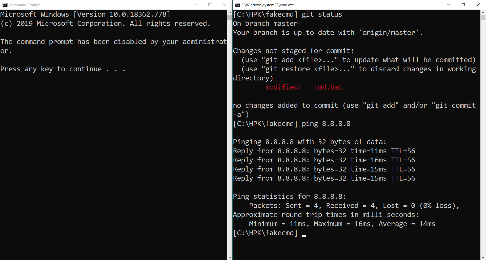

# fakecmd

Command Prompt for Windows that runs on .bat.

Append to the PATH variable by modifying the PATH.txt file. Please use absolute paths separated by semi-colons (;).
It is recommended to install programs in ./include. This folder is included in %PATH%.
